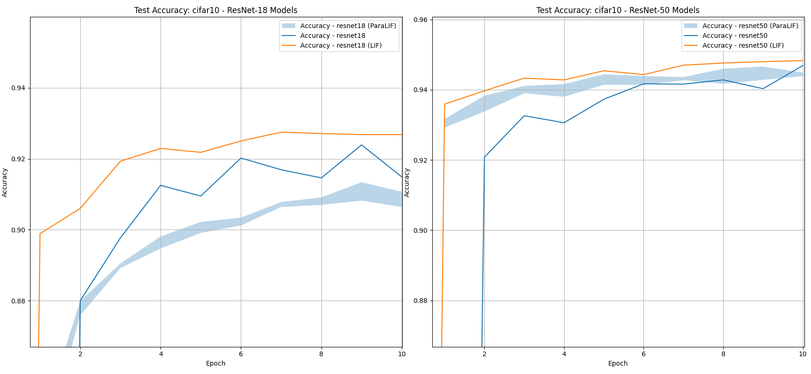
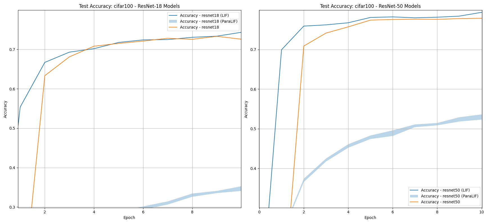
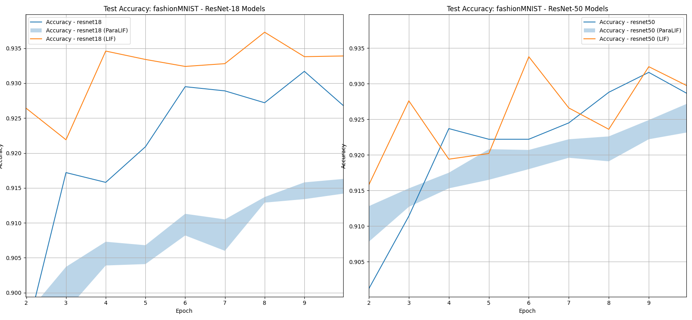
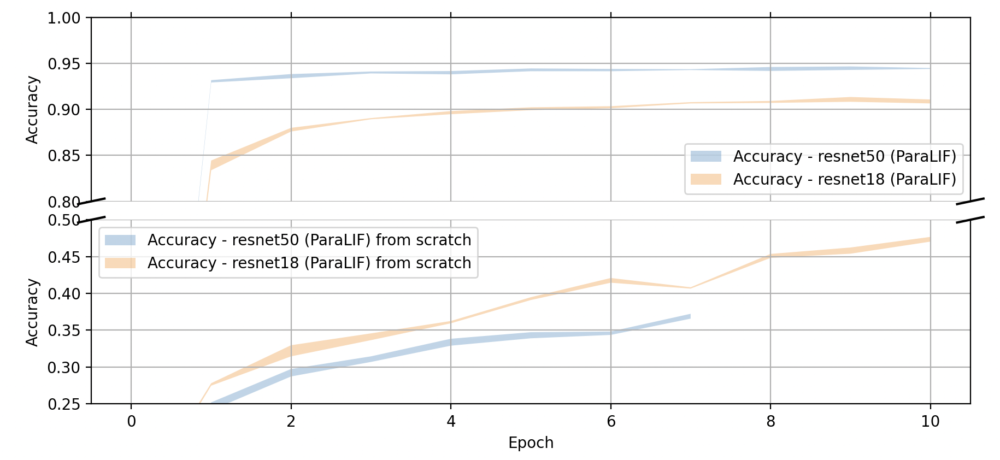

# Spiking ResNet/ViT Architectures/Variants Re: Advaserial Robustness
We want to know how the robustness characteristics of LIF/ParaLIF based neurons scale. This study looks at utility of adopting ParaLIF/LIF for the decoder stages of a ResNet and ViT.
We heavily employ transfer learning techniques alongsie an ANN-SNN conversion tactic to produce higher performing hybrid ANN/SNN models.

## Descriptions
ResNet-18 is more for quick indication of progress really, **ResNet-50** is a more interesting benchmark and **ViT 16B** is more or less a fun exercise to walk through deployment processes (against GCP).

- **Default**: The standard architecture of ResNet/ViT without any modifications.
- **LIF**: An architecture variant where decoder neurons are replaced with Leaky Integrate-and-Fire (LIF) neurons.
- **ParaLIF**: A variant similar to LIF, where decoder neurons are Parallel Leaky Integrate-and-Fire (ParaLIF) neurons. Implementation of the neuron is pulled [from here](https://github.com/NECOTIS/Parallelizable-Leaky-Integrate-and-Fire-Neuron) and lives copied in `paralif.py`.

### Methodology
- We fix the random seed for reproducable training.
- We fix the loss criterion to be the cross entropy loss (_this is only important as whitebox attacks are wrt. the optimizer used_).
- We transfer model weights that were learnt when heavily trained on ImageNet via adopting [pre-trained models](https://pytorch.org/vision/stable/models.html).
    - See [ImageNet performance here](https://pytorch.org/vision/stable/models.html#table-of-all-available-classification-weights).
- We take the preprocessing done to ImageNet images and apply them to the images in our specific datasets.
- We identify the 4 residual layers of ResNet as candidate "encoder depths" (we split the 11 layer depths of the ViT encoder over groups of 3). Initial depth is known to contain "low-level" features and as the depth progresses, features become more "specialisd"/"high-level" for a task.
- We **freeze** the model up to a depth, by prohibiting a layed computation graph overtop of any frozen layers.
    - Decided to freeze up to depth 3, as we want to fine-tune only "high-level" features.
- We then fine-tune this model onto various datasets like `CIFAR-100`, `CIFAR-10`, `FashionMNIST` and so on via native backpropogation.
- At some point, we then branch off of this model to either a *LIF* or *ParaLIF* variant, where we replace the model decoder part into either a LIF or ParaLIF part.
- We train via normal backpropogation through time with fixed number of steps of the observation window at 20.

## Performance
_The <X, Y> represents how long the training process took; on continuous model for X epochs, and Y epochs on the branched LIF/ParaLIF model_.

- We do have checkpoint files for everything, so these are all readily verifiable.
- For these branched ResNet's (ParaLIF) variants, we're also interested in the standard deviation of all inferences as ParaLIF is noticeably non-deterministic.

### CIFAR-10

| Variant  | ResNet-18       | ResNet-50       |
|-----------|-----------------|-------------------
| Default  | %92.4 _<10>_    | %94.7 _<10>_    |
| LIF      | %92.8 _<10,10>_ | %94.8 _<10,10>_ |
| ParaLIF  | %90.9 (±0.15) _<10,10>_ | %94.4 (±0.034) _<10,10>_  |

### CIFAR-100
| Variant  | ResNet-18       | ResNet-50      |
|-----------|-----------------|------------------
| Default  | %73.3 _<10>_    | %77.9 _<10>_   |
| LIF      | %74.3 _<10,10>_ | %79.4 _<10,10>_ |
| ParaLIF  | %34.9 ± 0.42 _<10,10>_ | %52.9 ± 0.45 _<10,10>_ |

### Fashion-MNIST
| Variant  | ResNet-18       | ResNet-50      |
|-----------|-----------------|------------------
| Default  | %93.2 _<10>_    |  %93.2 _<10>_  |
| LIF      | %93.7 _<10,10>_ |  %93.4 _<10,10>_  |
| ParaLIF  | %91.5 ± 0.08 _<10,10>_ | %92.5 ± 0.14 _<10,10>_  |

## Learning rate contrast of double transfer learning approach
We succesfully get to the top performing grades quickly on CIFAR-10 compared to training from scratch at a much quicker epoch rate too thanks to proper layer freezing.

## Robustness Measures
As this is where our focus predominately lies, we provide a pipeline of well known attacks at various intensities and contrast measure robustness.

- **Square Attack**, a blackbox attack (provided by [`ART`](https://github.com/Trusted-AI/adversarial-robustness-toolbox)); see: https://arxiv.org/abs/1912.00049
- **Deepfool Attack**, a whitebox attack (provided by [`foolbox`](https://github.com/bethgelab/foolbox)) see: https://arxiv.org/abs/1511.04599
- **Fast Gradient Sign Method**, a (super classic) whitebox attack (provided by [`foolbox`](https://github.com/bethgelab/foolbox)) see: https://arxiv.org/abs/1412.6572

All of these results are labeled and in `./results`.
